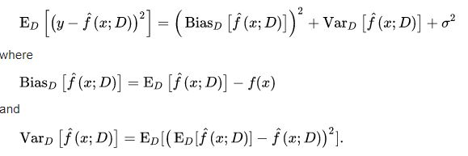
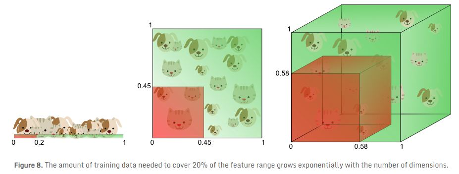
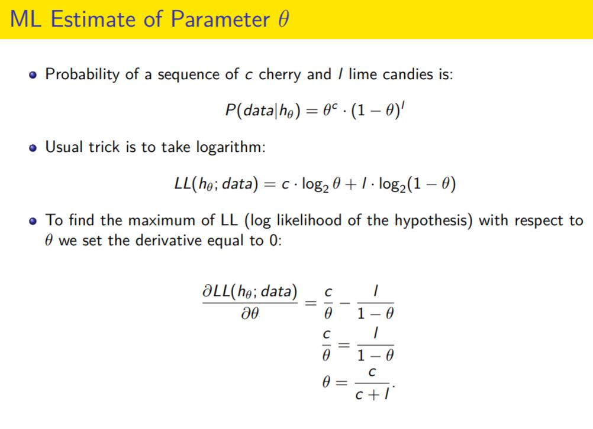
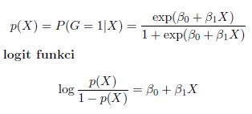
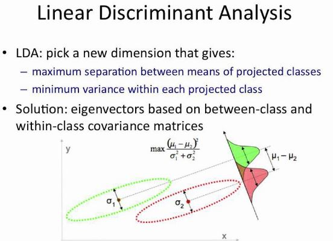
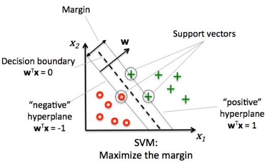
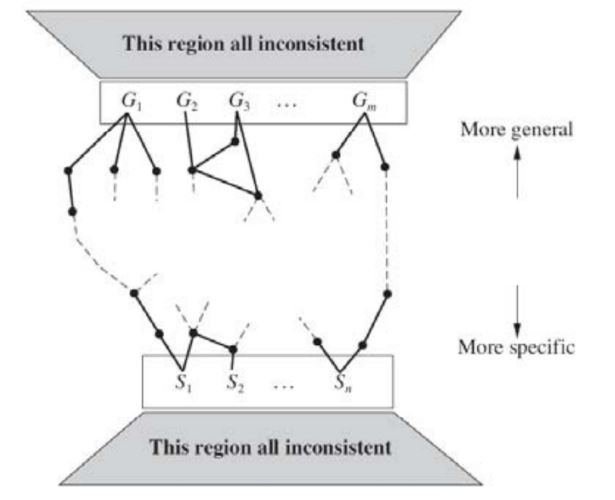

# Strojové učení a jeho aplikace
- Strojové učení
    - prohledávání prostoru verzí OK
    - učení s učitelem 
    - a bez učitele OK
    - pravděpodobnostní přístupy OK
    - zpětnovazební učení OK
    - teoretické aspekty strojového učení. OK
- Evoluční algoritmy OK
    - základní pojmy a teoretické poznatky
    - hypotéza o stavebních blocích
    - koevoluce
    - aplikace evolučních algoritmů. 
- Strojové učení v počítačové lingvistice. 
- Pravděpodobnostní algoritmy pro analýzu biologických sekvencí OK
    - hledávání motivů v DNA 
    - strategie pro detekci genů a predikci struktury proteinů

# Teoretické aspekty ML
- k-fold crossval, train/test split, bias-variance, overfitting, prokletí dimenzionality

### Pojmy
- Y - cieľová veličina, kvalitatívna/kvantitatívna
- X - príznaky
- chceme model ^f, ktorý aproximuje f, kde Y = f(X) + eps, kde eps je šum
- modely
    - **parametrické** (lin. regrese) vs **neparametrické** modely (k-NN)
        - výber funkcie vopred, potom už učenie parametrov
        - lin. regrese, LDA, Peceptron, Naive Bayes, Simple Neural Networks
        - jednoduchšie, stačí menej dát, ale limitované a horší fit
    - **neparametrické**
        - alebo to mapovanie zisťujeme počas toho
        - kNN, rozhodovacie stromy, SVM
        - flexibilita, ale pomalšie, viac dát
- učenie: s učiteľom a bez učiteľa (stromy vs clustrovanie)

### Data
- trénovacie : testovacie : validačné = 1/2 : 1/4 : 1/4 (alebo 2 : 1 ak bez validačných)
- stratifikovaný výber: zachovanie pomerov tried vo vybraných dátach
- u klasifikácie:
    - model povedal áno: True Positive, False Positive, 
    - model povedal nie: False Negative, True Negative
    - accuracy, error
    - precision = TP / (TP + FP)
    - recall = TP / (TP + FN)
    - specificity = TN / (TN + FP)

### Chyba
- E[(Y - ^Y)^2] = E[(f(X) + eps - ^f(X))^2]
- reducibilná (f(X) - ^f(X))^2
- ireducibilná var(eps) -- šum v dátach, vplyv nemeraných veličín, náhoda
- regresia
    - kvadratická chyba L(Y, ^f(X)) = (Y - ^f(X))^2
    - absolutná chyba L(Y, ^f(X)) = | Y - ^f(X) |
- klasifikácia
    - buď predikcia triedy, alebo vektor pravdepodobností
    - 0-1 chyba L(Y, ^f(X)) = I(Y != ^f(X))
    - **log-likelihood** L(Y, ^f(X)) = -2 Σ_k I(Y == ^f(X)) * log ^p_k (X), kde k cez všetky triedy
        - = -2 log ^p_Y (X)
        - vynásobí sa indikátor každej triedy s danou výslednou pravdepodobnosťou. Následne, čím vyššia táto pravdpeoodbnosť tým bližšie k nule je. Teda keď dám * -1, tak získam najlepšie výsledky pri nule.
- trénovacia chyba err = 1/N * Σ_N L(y_i, f(x_i))
- chyba generalizace: očakávaná chyba na testovacích (nezávislých) dátach
    - err = E[L(Y, f(x))]
    - vieme odhadnúť pomocou testovacích dát 1/T * Σ_T L(y_i, f(x_i))

### Bias-variance tradeoff
- preučenie na trénovacích -> väčšia chyba na testovacích
- iné vyjadrenie chyby:  
    
- bias = chyba spôsobená "zjednodušením sveta", tj. zlá voľba modelu (lin. regresia na kvadratickú funkciu)
- variance = rozptyl danej metódy, tj. ako veľmi sa zmení na základe iných trénovacích dát. Vysoký variance značí pretrénovanie na "šum" v dátach
- nižší bias ma vyšší variance a opačne
- snaha minimalizovaýť oba súčasne, 
- vysoký bias = underfitting, vysoká variance = overfitting
- vedie napríklad k regularizácii  


### Prokletí dimenzionality
- zvyšovanie počtu features vedie k exponenciálnemu zníženiu hustoty vzorkov v priestore
- spôsobí preučenie: vo veľkých dimenziách vždy existuje nadrovina
- problém: nedostatok trénovacích dát
- aby sme ziskali 20% dát tak potrebujeme: 
    - 1D: 20% populácie v danej dimenzii
    - 2D: 45% (0.45 * 0.45 = 0.2)
    - 3D: 58% (0.58 * 0.58 * 0.58 = 0.2)
- 
- môžme redukovať počet dimenzií, napríklad pomocou PCA (Principal Component Analysis)
    - z korelovaných príznakov získame menšie množstvo dekorelovaných (principal compoentns)
    - prvá komponenta má najväčší rozptyk (vysvetľuje najviac rozdielov), ďalšie sú na ňu kolmé, atď
        -> vznikne dekorelovaná ortogonálna báza
    postup: 1. eigenvalue decomposition. 2. singular value decomposition

### Cross-validation
- typicky v prípade nedostatku dát, kde nejde vyčleniť testovaciu množinu, prípadne pre stabilnejší odhad chyby
- k častí (folds), 1 fold ako testovací, ostatné trénovacie. Opakujeme cez všetky časti. Chyba ako priemer.
- k=5, k=10
- opakovať pre rôzne delenia, 10x10 fold crossvalidations = 10 folds 10 zopakovať
- **Leave-one-out cross-validation**
    - každý prvok vo vlastnom folde
    - výhoda: veľa trénovacích dát, nižší bias, lebo oproti celému datasetu mu chýba len jedna vzorka
    - nevýhoda: náročné, vyšší variance (iný dataset z rovnakého distribution dá úplne iné výsledky)

### Bootstrap sampling
- výber s opakovaním, 36.8% šanca, že bude v testovacom datasete
- metóda proti overfitting
- možné použit pre bagging (viacero modelov pre tú istú úlohu)

### Regularizace
- balancovanie bias variance
- znižuje overfitting (ako crossvalidace), znižuje variance, za cenu nízkeho bias
- constrains the coefficients towards zero
    - penalizes more complex models
- **ridge regression** Err = RSS + lamda * sum beta_j ^2
    - lambda how much penalize the flexibility of the model
    - L2 norm of the parameters
- **lasso** Err = RSS + lamda * sum | beta_j |
    - L1 norm
    - tendencia nejaky parameter stiahnuť k nule (kosoštvorec v kruh podľa tej funkcie. Elipsa sú riešenia. Pretne sa to na osi.)
    - vyššia interpretovateľnost = viac nulových členov

# Pravděpodobnostní přístupy v ML
- MAP, Maximum Likelihood + niečo z klasického supervised ML
- kde sa používa, či MAP alebo Maximum Likelihood

- update your knowledge based on the evidence incrementaly = Bayesian learning
- use Bayesian theorem to determine the conditional probability of the hypothesis given the evidence
    - **P(θ | X) = P(X |  θ) * P(θ) / P(X)**
    - P( θ) - **prior probablity** of the theorem being true. "beliefs" before applying the theorem
    - P(X |  θ) - **likelihood** of the evidence given the hypothesis
    - P(X) - probability of the evidence
        - P(X) = sum_theta P(X |  θ) * P( θ) // suma cez vsetky hypotezy
    - P(θ | X) - **posterior probability**, probability of theta after observing X

## Štatistik
- možno odhadnúť parameter rovno na základe počtu hodení mincov, nevieme ale zaviesť nejake "beliefs"

## Maximum a Posteriori (MAP)
- determine the valid hypothesis out of set of hypothesis
- hypothesis with the maximum posteriori probablity is the best
- θ_MAP = argmax_θ P(θ | X)
- prior probabilities menia to, ktorá hypotéza vyhraje
- P(X) je nezávislé od θ, teda rovnaké pre všetky, môžeme zjednodušiť
    - θ_MAP = argmax_θ P(X | θ) * P(θ)
    - zjednodušením získavame **Maximum Likelihood**
        - predpokladáme rovnakú apriórni pravdepodobnosť
        - θ_MAP = argmax_θ P(X | θ)
        - dobrá aproximácia pre veľa dát = dáta prevážia apriorni rozloženie hypotéz
        
        - v pripade viacerých parametrov sa robia parciálne derivácie voči každému parametru

- bruteforce MAP = for each hypothesis calculate the posterior prob.

## Minimal Description Lenght (MDL)
- Occamova britva - preferuj najkratšie hypotézy
- θ_MDL = argmin (L(h) + L(D|h))
    - L = description length under an encoding
    - trades off model size for training errors
    = argmin (-logP(d|θ)) - logP(θ)
        - log P(θ) = length of θ
        - log P(d|θ) = length of D given θ 

## Bayes optimal classifier
- θ_MAX nie je najlepšia, ale vážený priemer hypotéz
- výpočetne drahé
- Gibbs algorithm: náhodne vyber hypotézu proporciálne k P(θ|D) a podľa nej klasifikuj
    - no worse than twice Bayes
- ak je náš model sveta správny, žiadny iný model nemá menšiu chybu

## Naive Bayes classifier
- stredne veľké až veľké dáta (počet)
- attributy sú nezávislé, za podmienky klasifikácie
- použitie: diagnózy, klasifikácia textových dokumentov
- Naive Bayes Assumption P(a1, a2, ..., an | v) = P(a1 | v) * P(a2 | v) ... * P(an | v)
    - often violated, works still well
- v_MAP = argmax_v P(v | a1, a2, ...)
    = argmax_v P(a1, a2, .. | v) * P(v) / P(a1, a2, ...)
    = argmax v P(a1, a2, ... | v) * P(v)
- with assumption gives:
    - v_NB = argmax P(v) * P(a1 | v) * P(a2 | v) ... * P(an | v)

## Učenie parametrov
- nepoznáme apriorne pravdepodobnosti modelov, ani rozloženie pravdepodobností pre jednotlivé modely = odhadneme z dat

## EM (expectation maximization)
- odhadneme skryte premenné
- M zvyšuje vierohodnosť modelu, E dopočítame na úplný model (predpokladáme, že hodnoty poznáme)
- napr. výška medzi ženami a mužmi, sú t odva gaussiány, nepoznáme parametre N(u, s)

# Evoluční algoritmy
- veta o schématech
- Neuroevoluce, hyperparametry, LCS, kombinatorická optimalizace
- viď prirodou inspirovane uceni

# Učení s učitelem
- rozhodovací stromy a prerezávanie

## Linearni regrese
- Y ~= β0 + β1 * X (+eps)
    - odhad β z dat
    - +eps značí šum
- residuum e = y - ^y = y - (β0 + β1 * x)
- RSS - residual sum of squares e1^2 + e2^2 + e3^2 .. + e_n^2
    - minimalizovat
    - zderivujeme a položíme rovno nule (pre β0 je to ľahké)
    - 
- viacrozmerná lineárna regressia β = (X^T X)^{-1} * X^T * y
- kvalitatívne premenné - použijeme dummy premenné, pre k tried je potrebné vziať k-1 (kóduje jedničkou čo to je)
    - pozor zmena významu jednotlivých β
- non linear regression - polynomiálne, exponenciálne...
    - tie xi sú na druhú a pod
- problémy
    - korelovaná residua - podhodnotenie chyby
    - nekonštatný rozptyl - použi logaritmickú transformáciu vstupu
    - outliers - zvyčajne slabo ovplyvní
    - high leverage point - vzdialený bod na xovej osi, môže silno ovplyvniť

### Odhad chyby parametrov


## Lineárne modely pre klasifikáciu
- klasifikace
- predikcia triedy alebo pravdepodobnostného rozloženia
- môže byť lineárna ale nie lineárnu regresiu
    - číselné kódovanie prináša neexistujúcu informáciu (zotriedenie)
    - negatívne pravdepodobnosti
    - malá sila, nejaká trieda schovaná inou

### Logistická regrese
- predpokladáme binárnu klasifikáciu, chceme predpovedať pravdepodobnosť, teda medzi 0 1
- logistická funkce a logit funkce  

- učenie parametrov pomocou **maximalizace verohodnosti**
    - l(B1, B2) = sucin p(xi), kde yi je true * sucin 1 - p(xi), kde yi je false
- viac prediktorov - do sumy pridaj dalsie bety
- viac klasifikačných tried - nepoužíva sa, radšej LDA

### LDA Linear Discriminant Analysis

- projektuje na menší priestor, možno použiť ako dimensionality reduction
- predpoklad normálneho rozloženia

## SVM Support Vector Machine
- binarny klasifikátor, hľadá deliacu nadrovinu
- maximalizuje margin - tj vzdialenosť najbližsieho prvku k nadrovine
- kóduje do -1 a 1  

- maximalizujeme nasledujuci výraz

- riešenie pomocou úpravy len minimalizovania bety, ktorá sa dá odvodiť pomocou Lagrangeových multiplikátorov
- následne riešime duálnu formu problému - convex quadratic optimization problem - solved by quadrating programming alg.
- **soft margin** - pre neseparabilné prípady povolíme slack - tz. že môžeme byť na opačnej strane, alpha pre kotnrolovanie tradeoff
- možnosť použiť kernel trick - implicitne konverzia do viacdimenzionálneho priestoru (resp. iného), aby boli separabilné
    - transformovať priestor rovno, použiť SVM a opakovať s rôznymi transformáciami je výpočetne náročné
    - v duálnej forme je jediné miesto, kde sa používajú vstupné vektory -> môžme použiť na nich funkciu = kernel
    - pomalé - transformovať vektory a potom urobiť dot product
    - rýchlé - urobiť dot product a potom nejakú úpravu
    - rôzne kernely
## Rozhodovací stromy
- koreň a vrcholy sú označené atributom, kde vedie hrana pre každú hodnotu atributu (alebo hranice)
- listy sú cieľové hodnoty
```
vyber atribut, rozdeľ uzol
pre každú hodnotu vytvor podstrom
ak data obsahujú už len cieľovú hodnotu jedného druhu, alebo už nie sú atributy, alebo je dosiahnutá maximálna hĺbka
    skonči listom s najpočetnejšou cieľovou triedou
```

- regresné stromy - list - priemer hodnôt, chyba môže byť RSS
- klasifikačné
    - stále snaha minimalizovať nejaký error
    - evaluate the quality of some split
    - **classification error rate** - fraction of training observations in a region, that do not belong to the most common class
        - nedostatočne "jemný". Napríklad nejaké splity nemusia viesť k zlepšeniu erroru a v tom bode by sa program zastavil, lebo došlo ku "konvergencii"
        - E = 1-max_k(p_{mk}), p_{mk} = proportion of training observations in the mth region from kth class
    - **gini index**
        - measure of purity, total variance across K classes
        - G = sum_k p_mk (1 - p_mk)
    - **information entropy**
        - - sum_k p_mk * log p_mk
    - spočíta sa entropia pred rozdelením, a po rozdelení je to vážený priemer entropií výsledných vrcholov. Snažíme sa maximalizovať tento rozdiel.

### ID3
- používa entropiu
```
1. Calculate the entropy of every attribute a of the data set S.
2. Partition ("split") the set S into subsets using the attribute for which the resulting entropy after splitting is minimized; or, equivalently, information gain is maximum.
3. Make a decision tree node containing that attribute.
4. Recurse on subsets using the remaining attributes.
```

### CART
- používa gini index
- stopping criterion - minimálny počet prvkov v liste

### Prunning
- Reduced error prunning
    - start at leaves, each node is replaced with its most popular class. If not worse accuracy on the heldout than keep the change.
- Cost complexity prunning
    - cutting the branches iteratively, creating multiple trees T1, T2, ..Tm. At the end, the best one is chosen
    - Tm is only the root
    - Ti is created by cutting a subtree (and replacing with the most common class) from Ti-1.
    - cut the subtree, which minimizes err(pruned) - err(orig) / (#leaves(org) - (#leaves(pruned)))
        - may add alpha to the size of the tree penalization
    - choosing based on cross validation

### Chýbajúce hodnoty
- ignorovať vzorek
- nová hodnota "missing" (na trénovanie)
- alebo choď kde je viac vzorkov

### Ensembles
- decision trees sú nestabilné, vysoká variance
- natrénovať viac modelov, predikce priemerovať, alebo vybrať najčastejšiu triedu
- **Bagging** (boostrap aggregating)
    - 100 - 1000 rozhodovacích stromov
    - bootstrapping, výber trénovacích prvkov s opakovaním
    - neprerezané
    - **Out of Bag error estimation**
        - boosting prirodzene vytvára testovací set (netreba crossvalidaci)
        - B/3 modelov nepoužíva i-ty prvok
        - celková chyba = priemer chýb (MSE alebo log likelyhood) cez prvok
- **Random forest**
    - pri každom splite len **vybráná podmnožina** attribút (typicky odmocnina celkového počtu)
    - dekorelace stromov, zamedzí jeden silný prediktor vo všetkých koreňoch
- **Stacking**
    - dve úrovne
        - vyššia - jednoduchý jeden alg., ktorý kombinuje predikce modelov z nižšej
        - nižšia - napr. stromy, musí predikovať nielen triedu ale aj dôveru v predikciu
    - miera chyby - modifikované one-leave-out
        - minimalizuj a nájdi váhy w
        - chyba cez každý prvok, kde sa použije daný model bez jedného prvku (ten voči ktorému rátame chybu)
        
    - predikce - vážené predikce nižších modelov
- **Boosting**
    - stromy sa stavajú iterativne, na základe chýb predošlého
    - zle ohodnotené prvky majú vyššiu váhu
    - **AdaBoost**
        - citlivý na šum a outliers
        
        - chyba m-tého klasifikátora je chyba 1-0 (vážené váhou prvkov)
        - váha klasifikátoru je vyššia s nižším errorom
        - váha prvku sa aktualizuje, nakoniec normuje
    - **boosting regresní stromy**
        - odhad aktualizuj pridním lambda*nový strom
        - residua zmenš o lambda * novy strom
        - vráť vážený odhad pomocou lambda

# Učení bez učitele
- bez učitele ako s učitelem
    - dané dána YES
    - náhodne vygenerovaný šum je NO

## Klastrování

- (usually) many parameters to choose
- prolem with outliers
- soft clustering - assign multiple classes

### k-means
```
given k (num clusters)
assign point to closest cluster
recompute cluster centers
```
- local optima
- multiple restarts - best run

#### Distance measure
- influences the result
- across the attributes may be needed to scale
- carefully with point normalization, may remove the "natural clusters"

#### choice of k
- increasing number of clusters reduces the average distance inside the clustes
- plot this error and fint a point, when it slows the improvement
- alternatvely compare the behaviour on random data with ours -> biggest gap is the best

### Hierarchical clusterung
- dendogram -dataset x-axis, y-threshold for distance
- have to select the right level
- methods
    - bottom up - single elemnt in a cluster
        - merge two clusters with minimal distance until all in 1 cluster
        - distance between the clusters = linkage
            - **single linkage** - dist. between the closest points - min of distances
            - complete linkage - dist. between the furtherst points - max of distances
            - average linkage - average of the distances
            - centroid linkage - distance between the centroids of the clusters


## Asociačné pravidlá
- aké položky nakupujú ľudia často spolu?
- n observations with corresponding probability P(X)
- want to find the characteristics of P(X)
- association rules
    - conjuctive rules describing spots with high density of X
    - for binary data and high dimensionality data
    - finds the most common combination of attributes

# Apriori algoritmus
```
jednoprvkove mnoziny, vyluc s cetnosti < t
opakuj pre viacprvkove
    ku i-1 ticiam pridaj prvok
    spocitac cetnosti, vyluc s nizkou cetnosti
```
- vhodný i pre veľké dáta
- vyhýba sa prokletí vďaka málo preživším kombináciam
- podmnožina četnej kombinácie je tiež četná
- max d priechodov dátmi, d je najdlhšia kombinácia
- možno vytvoriť asociačné pravidlá, K je množina, ak A tak B, kde A U B K
    - výpočetne nenáročné
    - optimalizujeme na četnosť a presnosť (dolný prah na presnosť)
    - **support** (podpora) T(A -> B): A & B (cetnost K)
    - **confidence** (presnost) C(A -> B): T(A -> B) / T(A) (funguje ako odhad P(B | A))
    - **lift** (zdvih) L(A->B): C(A->B)/T(B) 

## Principal Component Analysis
- finds the important "directions"

# Prohledávani prostoru verzí
- to solve ML task we need: Data, Hypothesis, miera, na koľko hypotéza odpovedá dátam
    - cieľom je nájsť hypotézu, funkciu, ktorá na základe dát určí správne cieľový atribut

Prostor hypotéz
- hypotézy v našom prípade sú konjukce testov vstupných atributov pre Yes
    - <?, Cold, ?, ?> ? I dont care, ∅ znak pre nesplniteľnú podmienku (tie sú všetky ekvivaletné)
    - pre binárne atributy máme 3^(poc atributov) + 1 hypotéz (za nesplniteľnú)
- systematické prehľadávanie priestoru hypotéz
    - prostor je částečne usporiadaný inkluzí (antisymetria, tranzitivita (chýba "úplnosť"))
        - h1 > h2 : h1 je obecnejšia než h2, h2 je špecifickejšia
        - najobecnejšia <? ? ? ?>
        - najšpecifickejšia <∅, ∅, . . . , ∅>
        - prostor všech hypotéz tvorí svaz
        
- ohodnocovací funkce
    - určuje nakolik hypotéza odpovedá dátam
    - hledáme hypotézu, ktorú by splňovali všetky pozitivné príklady a nesplňoval žiaden negatívny
    - if hypoteza then (result = yes) pre všechna data pravdivá
        - lze len bez náhody a šumu

## Nalezení maximálne specifické hypotézy
- Algoritmus FIND-S
```
h = <∅, ∅, . . . , ∅>
pre kazdy pozitivny priklad x
    pre kazdu podmienku na atribut Ai = ai v h
        ak x nesplnuje Ai=ai
            nahrad podmienku najblizsou obecnejsou, ktoru x splnuje
        inak h bez zmeny
vydaj h
```
- hypotéza na konci nie je jedina konzistentná s dátmi, akú teda vybrať?
    - maximálne obecnú?
- budeme hledat všetky hypotézy konzistentné s dátami

## Prostor verzí
- prostor verzí vzhledem k prostoru hypotéz H a trénovacích dát D je podmnožina hypotéz z H konzistentná s daty D
    - každá hypotéza je v priestore medzi obecnou a specifickou hranicí
    - obecná hranice G vzhledem k H a D je množina maximálne obecných hypotéz z H konzistentných s daty
    - specifická hranice S je maximálne specifických konzistentých hypotéz

### Candidate Elimination
- G obecné, S specifické
```
pre kazdy priklad d
    if d pozitivni
        odstran z G vsetky hypotezy nekonzistentne
        for each s z S, s nekonzistentny s d
            odstran s
            pridaj do S vsetky h, minimalne zobecnenie
        odsrtan z S hypotezy, ktore nie su maximalne specificke
    if d negativni
        odstran z S nekonzistentne s d
        for each g z G, g nekonzistetne s d
            odstran g
            pridaj h, minimalne specifictejsi nez g
        odstran z G, ktore nie su maximalne obecne
```
- nahradzujeme priamimy otcami, resp. potomkami
- končí
    - vyčerpali sme všetky príklady, výsledné hypotézy sú disjunkcia, ak zvyšné klasifikujú rôzne, tak majoritný hlas
    - zostlaa jedina hypotéza
    - priestor skolaboval (množina G, alebo S je prázdna)


# Zpětnovazební učení
- definice, pasivni vs aktivni agent, ADP, TD, Sarsa, Q-learning

- učení bez učitele
- spätná väzba = ocenenie výkonu
    - buď na konci (kto vyhral) alebo po každom ťahu
    - je súčasťou vstupu
- **pasivné učenie**
    - pevná strategia, učí sa len úžitok akcii a stavov
- **aktívne učenie**
    - zahrňuje prezkúmavanie prostredia
- agenti
    - **utility based** = agent so žiadosťami - funcke užitku pro stavy
    - **agent s Q-učením** - učí sa akcie na základe úžitku
    - **reflexný agent** - učí sa stratégiu

## Pasívne učenie
- π(s) - stratégia je vopred daná
- cieľ: ohodnotiť stratégiu, naučiť sa ohodnotenie stavov - Utility func: U(s) a prechodovú funkciu
    - Uπ(s) = E[sum γ^t * R(s_t)], cez t = 0, ... inf
- **priamy model** 
    - stavy sú "nezávislé" (v skutočnosti neplatí, platí Bellmanova rovnice)
    - ocenenie stavu je priemer ocenení ciest vedúcich do cieľa cez tento stav
- **ADP** Adaptivní dynamické programování
    - iteratively learns transition & rewards model
    - Bellman equation: Uπ(s) = R(s) + γ Σ_s‘ P(s‘|s, π(s)) Uπ(s‘)
    - riešiteľný pomocou **Value Iteration**
        - cez počet iterácii, cez všetky stavy, update the value
    - učí sa prechodovú tabuľku a ocenenie stavov
- **Temporal difference**
    - model free, does not learn transition model
    - update based on the successive state
    - Uπ(s) ← Uπ(s) + α.(R(s) + γ.Uπ(s‘) - Uπ(s))
        - α learning rate (determines convergence)   

## Aktívne učenie
- uči sa optimálnu policy π(s), musí sa teda naučiť aj utility stavov
- greedy agent -> pasívne učenie a potom zmena policy
- explorace vs. explotace: zkoušení nových strategií vs. zlepšování slušných již nalezených
    - s určitou p vyber náhodnou akci regardless learned stuff 
    - vybírej vždycky argmax / podle distribuce (při učení)
    - higher weights to unexplored actions, lower weight to actions with lower utilities

### ADP with exploration function
- U_{i+1}(s) = R(s) + γ max_a f(Σs‘ P(s‘|s, a) U_i(s‘), N(s,a))
    - N(s, a) - number of tries of action a in state s
    - f(u, n) - exploration function that increases with expected value u and decreses with number of tries
        - inf if n < threshold
        - u otherwise

### Q-learning
- TD method, without trnasitional model, instead learns Q-value
- U(s) = max_a Q(s, a)
- Q(s,a) ← Q(s,a) + α.(R(s) + γ max_a‘ Q(s‘,a‘) - Q(s,a))
- a_next = argmax_a' f(Q(s',a'), N(s', a'))
- simpler, but slower than ADP

### SARSA State-Action-Reward-State-Action
- Q(s a) , ← Q(s a) + Q(s,a) + α.(R(s) + (R(s) + γ.Q(s‘
,a )‘ - Q(s a))

### Summary
- SARSA, Qleanirng slower than ADP
- SARSA, Qlearning both converge to optimal
- model free methods (e.g. Q-learning) don't need knowledge base for environment modeling
- for more complex environments knowledge based approach with explicit trainsition model can be better (ADP)

- REINFORCE algoritmus
    - Neuronová síť implementuje policy (state->action), podle odměny připočteme/odečteme gradient pro vybranou akci  

# Strojové učení v počítačové lingvistice
- entropie - pX(x) je pravdepoodbnostné rozdelenie X a omega základné javy 
    - H(X) = - sum p(x)*log p(x) cez x z omega
    - H(X, Y) <= H(X) + H(Y)
    - H(Y|X) <= H(Y)
    - miera neistoty, v bitoch, najvyššia pre uniformné rozdelenie
    - minimálny počet bitov pre zakódovanie informácie
- podmienená entropia 
- cross entropia 
    - na koľko naše pozorovania odpovedaju očakávanému rozdeleniu
    - používa sa na porovnanie rozdielnych distribúcií, ktoré lepšie zodpovedajú skutočnosti
    - dá sa počítať aj jednoduchšie cez testovacie dáta 
- mutual information MI(X, Y) = H(X) + H(Y) - H(X, Y)
- modelovanie jazyka
    - obmedzená pamäť - markokvov proces (nemení sa funkcia prechodu a zároveň história je obmedzená)
    - p(x | a b) sa dá odhadnúť četnosťami toho trigramu a b x deleno četnosť dvojgramu b x
    
- vyhladzovanie jazyka
    - nulove pravdepodobnosti urobia bordel
    - buď pridaním lambdy, tj. odobranie nenulovým a rozdanie nulovým (špecialný prípad je jednotka)
        - p(w) = c(w) + 1 / T + V, kde T je velkost trenovacej a V je pocet slov v slovniku
    - linearni interpolace
        - 0-gram je nenulovy, takze postavme n-gram ako kombinaciu mensich ngramov
        - parametry pre jednotlive sa odhadnu pomocou EM algoritmu
- triedy slov
    - ak máme malé dáta, tak by sme chceli vytvárať triedy a môžeme získať nové infromácie
    - na začiatku je každé slovo v samostatnej triede
    - spojíme dve triedy, s najvyšším informačným prínosom
- markovovy modely
    - pomocou nich môžeme napríklad zistiť najpravdepoodbnejšiu postupnosť stavov, ktoré vygenerovali daný reťazec
    - spočítať pravdepodobnosť danej sekvencie
    - jej potrebné spočítať parametry Hidden Markov Model - opäť EM


# Pravděpodobnostní algoritmy pro analýzu biologických sekvencí
- hledávání motivů v DNA 
- strategie pro detekci genů a predikci struktury proteinů


- molekulárne biologicé data (DNA, proteiny)
- vyhledávaní subsekvencí v datech, srovnání podobných sekvencí, analýza sekvencí, predpoveď štruktúry a funkcie proteínu, vizualizácia, 
- genome - complete set of DNA
- gene - basic physical and functional units of heredity (dedicnost)
    - specific sequences of DNA bases that encode instructions on how to make proteins
- proteins
    - make up the cellular structure
    - large, complex molecules made up of smaller subunits called amino acids
    - form enzymes that send signals
    - regulate gene activity
    - body's major components
- DNA - hold information how cell works
    - two complementary strands
- RNA - act to transfer short pieces of information to different parts of a cell
    - temapltes to synthesize proteins

## SVM
- cancer classification
- protein fold recognition
- protein structure classification
- ...

## Hledání motivů
- len asi 1 % kóduje nejaké gén
- špeciálny proteín sa naviaže pred začiatkom génu a umožní čítanie a transkripci
    - značka v DNA - promoting region (označujeme ako motivy)
    - motív sa môže nachádzať kdekoľvek a môže byť zmutovaný
    - motív je sekvence nukleotidov (A, C, T, G)
- máme t DNA sekvencí dĺžky n (matica DNA t x n)
- hľadáme spoločný motív dĺžky l
- výstup: t štartovných pozícii
- konsenzus - najčastejší nukleotid na danej pozícii (lebo môžu byť zmutované)
- skóre - súčet počtu výskytov najčastejších
- brute force
    - spočítaj skóre pre všetky štartovné pozície
- Hidden Markov Models

## Protein structure prediction
- train NN to predict
- window for context